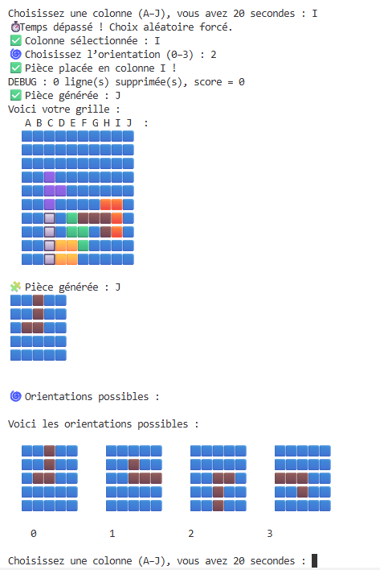

# Tetris en C 🧩

Ce projet est une version simplifiée du jeu Tetris, réalisée en langage C. Il fonctionne en terminal, avec une grille de 10x10, des pièces stylisé en couleur chargées depuis des fichiers texte, et une limite de temps pour placer les pièces.

---

## 🎮 Fonctionnalités

- Grille de jeu 10x10 avec fond bleu
- Lecture des pièces à partir de fichiers `.txt`
- Rotation possible dans les 4 sens
- Temps limité pour placer la pièce (sinon choix aléatoire)
- Vérification de la validité de la colonne 
- Suppression automatique des lignes pleines
- Affichage de la grille en terminal (avec des emojis)
- scores sauvegarder et trié du meilleur au plus mauvais dans score.txt

---

## 🖼️ Aperçu du jeu dans le terminal

> Voici à quoi ressemble l’interface principale du jeu :
 

## Déroulement  du jeu

* Le jeu se déroule sur une **grille de 10 lignes sur 10 colonnes** composée d'emoji bloc bleu.
* Une pièce de formes variées (L, T, J, etc.) apparait et doit être placée par le joueur.
* Pour chaque pièce :

  * Le joueur choisit une **colonne** (de `A` à `J`) pour positionner la pièce.
    * Il choisit également une **orientation** parmi 0°, 90°, 180°, ou 270° en tapant sur le chiffre de l'orientation voulue (voir aperçu).
    * ⏳ **Temps limité** : le joueur dispose de 20 s pour répondre.
      Si ce délai est dépassé, la **colonne** et la **rotation** sont choisies **aléatoirement**.
    * si le joueur place la pièce et qu'elle se retrouve a moitié en dehors de la grille a regenere une piece et on continue a jouer
      * Lorsqu’une **ligne complète** est remplie, elle est automatiquement **supprimée** et les lignes supérieures sont décalées vers le bas.
      * Game Over si : une pièce dépasse la partie la plus haute de la grille

      * Fonctionnement du score : 
        -  100 points par ligne complete
      ---

### 🔧 Compilation

```bash
git clone https://github.com/sr04x/Projet-MI4-grp-C.git
cd Projet-MI4-grp-C
make clean
make tetris
./tetris

#### organisation des fichiers

├── src/ 
│   ├── piece.c
│   ├── grille.c
│   ├── score.c
│   ├── partieee.c
│   └── timer.c
│   
├── header/
│   ├── piece.h
│   ├── grille.h
│   ├── score.h
│   ├── partieee.h
│   └── timer.h
├── score.txt
├── style_piece/
│   ├── L_piece.txt
│   ├── T_piece.txt
│   └── ...
├── README.md
└── Makefile

## 👥 Contributeurs

- **Sarah Xerri** — gestion des pièces : mise en forme, lecture depuis fichier, rotation et du timer
- **Yanis Nayme** — gestion de la grille : affichage grille, affichage bloc dans la grille et du score
- **Alaa Ouazbir** — gestion principale : assemblage du jeu pour le rendre jouable, game over, suppression de ligne complète...
